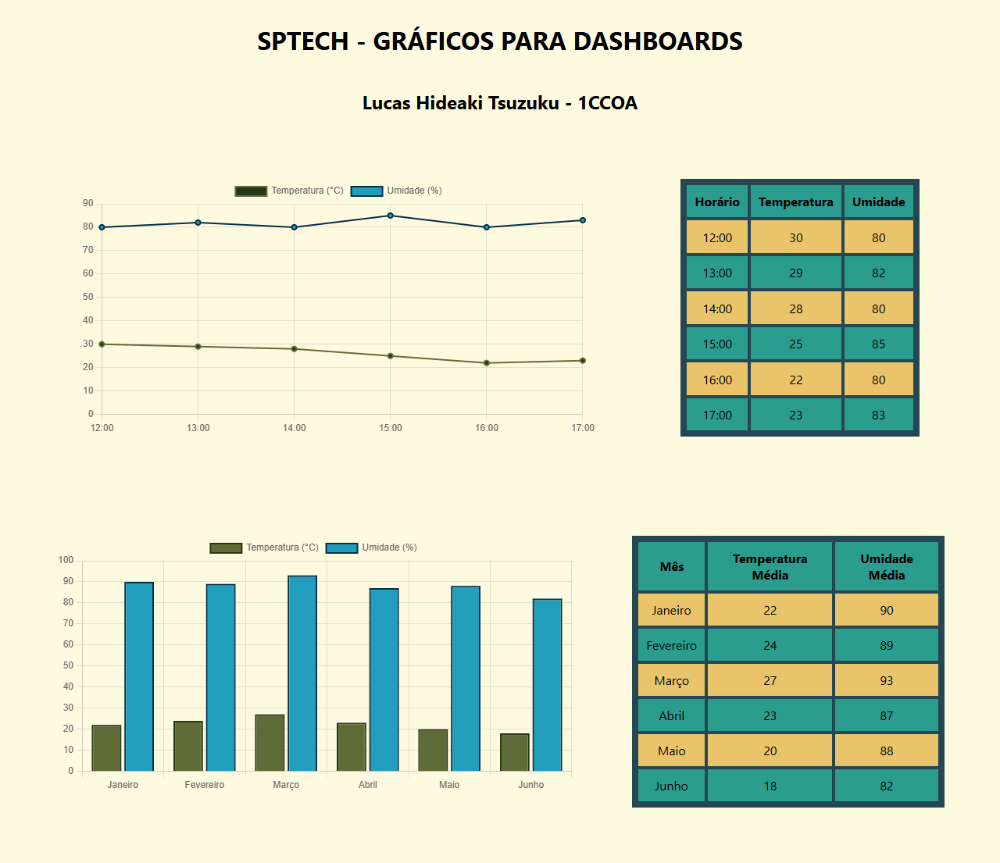

# SPTECH Chart.JS 🚩

Desafio da Alura baseada no curso "Praticando Spring Framework: Challenge Fórum Hub"

## Objetivo 📜

Crie uma página HTML e utilize a biblioteca "Chart.JS" como foi explicado, criando uma dashboard como a imagem abaixo:

Figura 1: Gráfico do vídeo de chart.js da SPTECH

Para facilitar, estes são os dados:

Gráfico de Linhas:

| Horário | Temperatura | Umidade |
| ------- | ----------- | ------- |
| 12:00   | 30          | 80      |
| 13:00   | 29          | 80      |
| 14:00   | 28          | 80      |
| 15:00   | 25          | 80      |
| 16:00   | 22          | 80      |
| 17:00   | 23          | 80      |

Gráfico de Barras:

| Mês       | Temperatura Média | Umidade Média |
| --------- | ----------------- | ------------- |
| Janeiro   | 22                | 90            |
| Fevereiro | 24                | 89            |
| Março     | 27                | 93            |
| Abril     | 23                | 87            |
| Maio      | 20                | 88            |
| Junho     | 18                | 82            |

Mês Temperatura Média Umidade Média
Janeiro 22 90
Fevereiro 24 89
Março 27 93
Abril 23 87
Maio 20 88
Junho 18 82

Caso queira, pode adicionar CSS à página!

Formato de entrega:

Crie um repositório PÚBLICO para subir o código desenvolvido, e envie o endereço do GitHub contendo seu repositório PÚBLICO com os arquivos criados para esta tarefa.

## Ferramentas e tecnologias 👨‍💻

- Java Script
- CSS
- Chart.js

## Passo a Passo 👣

- Criar repositório Github
- Criar página index.html
- Criar style.css
- Criar as divs com as tags canvas dentro
- Criar os gráficos com chart.js

## Resultados 🎁

Figura 2: Resultado da atividade

## Referências 📚

- https://www.devmedia.com.br/html-table-criando-tabelas-em-html/43487

- https://www.chartjs.org/

## Atualizações 🕐

- 2025/04/12 - Primeira versão do aplicativo

## Pendências 🚨

- Adicionar outros tipos de gráficos para estudos
